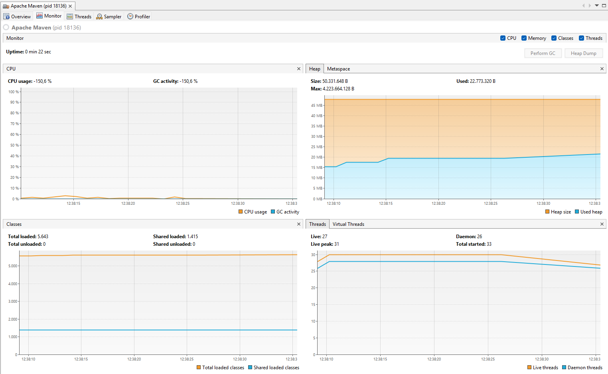
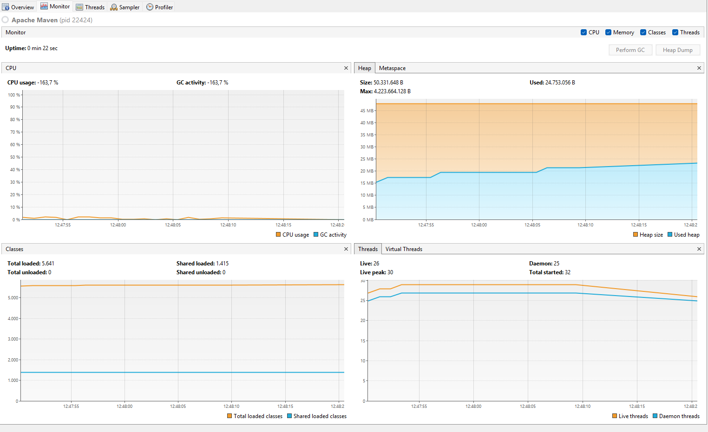

# Parte I — Productor/Consumidor con `wait/notify` (y contraste con busy-wait)

## Modo Spin

## Modo Monitor
 

1. Productor lento / Consumidor rápido

Cuando el productor genera elementos lentamente y el consumidor procesa muy rápido, el buffer se queda vacío con frecuencia.

- En mode=monitor: el consumidor debe quedar en estado WAITING (wait/notify), sin consumir CPU.
- En mode=spin: el consumidor entra en busy-wait, revisando constantemente el buffer vacío → consume CPU innecesariamente.

  El modo monitor implementa espera bloqueante eficiente, mientras que spin utiliza espera activa, generando potencial desperdicio de CPU cuando el buffer está vacío.

2. Productor rápido / Consumidor lento (capacidad pequeña)

Cuando el productor es más rápido y la capacidad del buffer es pequeña (4 u 8), el buffer se llena rápidamente.

- En monitor: el productor entra en WAITING hasta que el consumidor libere espacio → sin consumo de CPU.
- En spin: el productor revisa constantemente si hay espacio → busy-wait → uso innecesario de CPU.

  En mode=monitor, el productor libera el CPU al bloquearse mediante mecanismos de sincronización, mientras que en mode=spin permanece activo evaluando repetidamente la condición de disponibilidad.

3. Comparación CPU

Aquí está lo más importante para tu conclusión.

### mode=monitor

- Uso de CPU estable y muy bajo.
- GC activity mínima.
- No se observa comportamiento errático.
- Hilos en estado bloqueado cuando corresponde.
- En monitor, los hilos pasan a estado WAITING o BLOCKED.

### mode=spin

- Aunque en esta ejecución el CPU no parece alto, el modelo de espera activa implica consumo innecesario de ciclos.
- En pruebas más agresivas (más hilos o menos delay), el CPU suele incrementarse notablemente.
- Arquitectónicamente es menos eficiente.
- spin escala peor con más hilos.